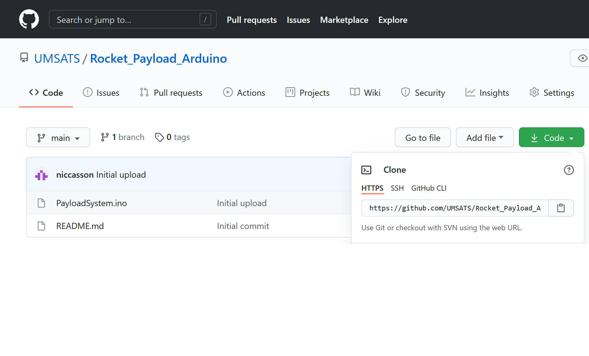
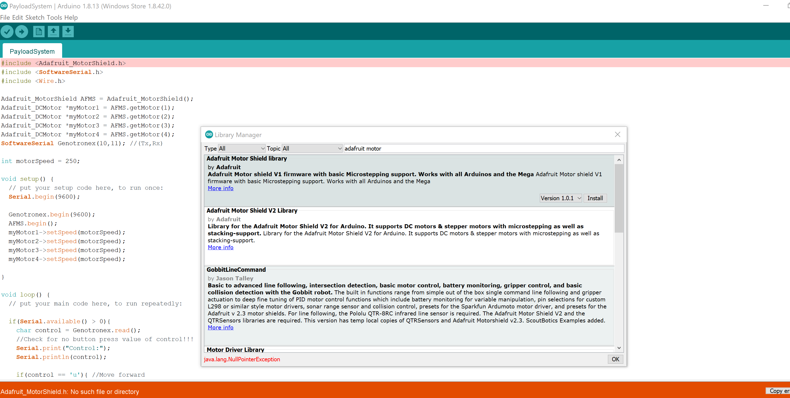
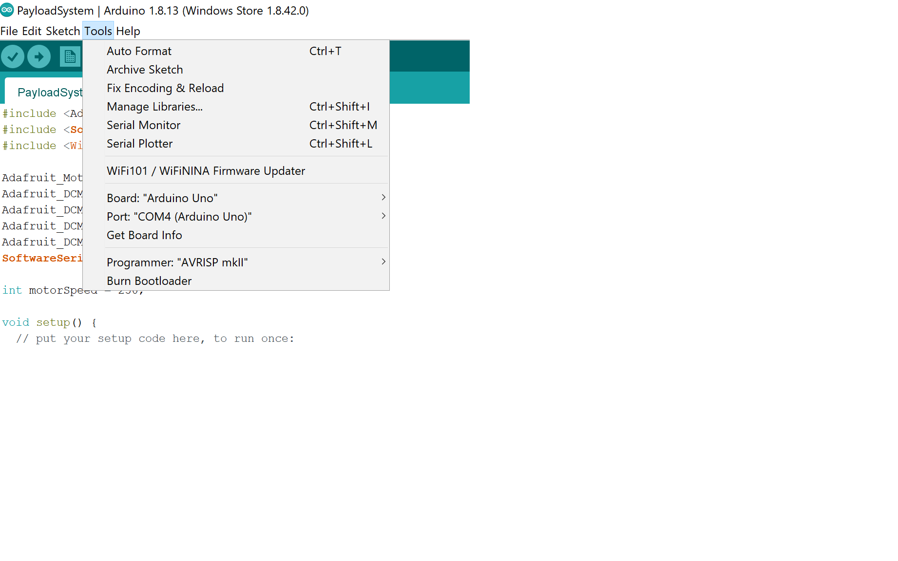
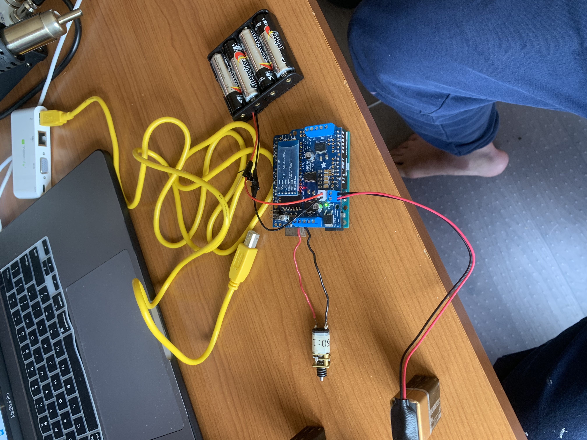

# Rocket_Payload_Arduino
Arduino version of rocket payload software.

## Versions
#### v1.0.0 - 2019 Spaceport America Cup Flight Software
- includes single arduino file

## How To Run Flight Computer Software

The rocket payload software is a simple single .ino arduino file that can be uploaded and ran taken the following steps.

To run the project:

  1. Got to -> https://www.arduino.cc/en/software and download the arduino software coresponding to your OS.
  2. Go to -> https://git-scm.com/downloads and download Git for your OS.
  3. Open terminal(MacOS)/cmd(Windows) and type 'git' to ensure the download was successfull.
  4. Navigate to the location where you want to download the payload software. (ex. cd C:\Users\namexx\Desktop\UMSATS_Code)
  5. Go to code and copy this repository link 
  6. Type **git clone** then paste the link of the repository you just copied and hit enter. This will install the repo and its contents to the current path in your terminal/cmd.
  7. Now open the Arduino IDE and open the PayloadSystem.ino file.
  8. Go to Sketch -> Include Library -> Manage Libraries and search **adafruit motor** then install **Adafruit Motor Sheild Library V2**. 
  9. Set up the environment by making sure under Tools -> Board: is set to **Arduino Uno** and Port: is selected to be the COMM port the uno is connected to. 
  10. You should now be able to verify and upload the code to the arduino board.
  11. Once successfull upload is complete, setup the follow hardware environment: 
  12. Now the rover setup is complete and all we need is to setup control.
  13. Go to this link: https://gallery.appinventor.mit.edu/?galleryid=14a3d907-13eb-4963-bf25-39dcbc8997cf and click **Load App Into MIT App Inventor** then go Build -> App (provide QR code for .apk)
  14. Download the app and you should be abble to BT connect to the rover computer system **within the app you downloaded NOT your settings**.
